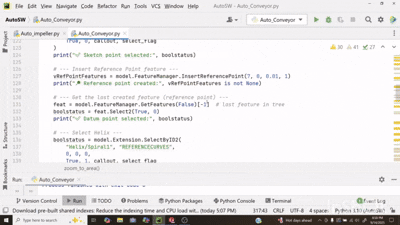

# Helical Screw Conveyor Design Automation with SolidWorks and Python

This Python script(private) automates the design of a **helical screw conveyor** in SolidWorks using the COM API. By providing key input parameters, users can automatically generate a 3D conveyor model with helical flights, customizable length, pitch, and flight thickness.

---

## Features

* Launches SolidWorks and starts a new part document automatically.
* Creates base geometry with specified inner and outer shaft diameters.
* Draws and extrudes the pipe body to the specified conveyor length.
* Inserts a helical sweep path based on user-defined pitch and start angle.
* Creates reference planes and sketches to define the flight cross-section.
* Sweeps the defined flight profile along the helix to generate the screw flights.
* Hides construction geometry for a clean final model.
* Sets the model view to isometric for better visualization.
* Fully automated workflow triggered by running the Python script.

---

## Input Parameters

The script accepts the following input parameters in millimeters (mm) to customize the design:

| Parameter        | Description                              |
| ---------------- | ---------------------------------------- |
| `inner_radii`    | Inner diameter of the shaft              |
| `outer_radii`    | Outer diameter of the pipe/conveyor body |
| `pipe_length`    | Length of the conveyor                   |
| `pitch`          | Helix pitch (distance between flights)   |
| `start_angle`    | Helix start angle in degrees             |
| `screw_flight_L` | Length of the screw flight cross-section |
| `screw_flight_t` | Thickness of the flight cross-section    |

---

## Usage

1. Make sure SolidWorks is installed and the SolidWorks COM API is available.
2. Set the correct SolidWorks part template path in the `template_path` variable.
3. Customize the input parameters as needed within the `main()` function.
4. Run the script(private) with Python; it will:

   * Launch SolidWorks
   * Create the conveyor model based on inputs
   * Automatically set views and clean up sketches for better presentation

---

## Example

```python
inner_radii = 20  # shaft diameter mm
outer_radii = 23  # pipe outside diameter mm
pipe_length = 350  # conveyor length mm
pitch = 50  # helix pitch mm
start_angle = 180  # degrees
screw_flight_L = 50  # flight length mm
screw_flight_t = 2  # flight thickness mm

# Running main() will create the helical screw conveyor with above parameters
main()
```

---

## Notes

* The script uses SI units (meters) internally, but all user inputs are in millimeters for convenience.
* The example template path is set for SolidWorks 2020; update it for your version accordingly.
* The script handles sketching, creating features, and hiding construction geometry for a clean model.

---

## Demo

A demo run will:

* Launch SolidWorks automatically
* Create a new part
* Draw shaft and outer pipe geometry
* Insert helix path
* Sweep the screw flight profile
* Hide sketches and planes for a clean final conveyor
* Present the conveyor in **isometric view** automatically



---
